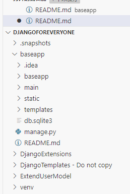
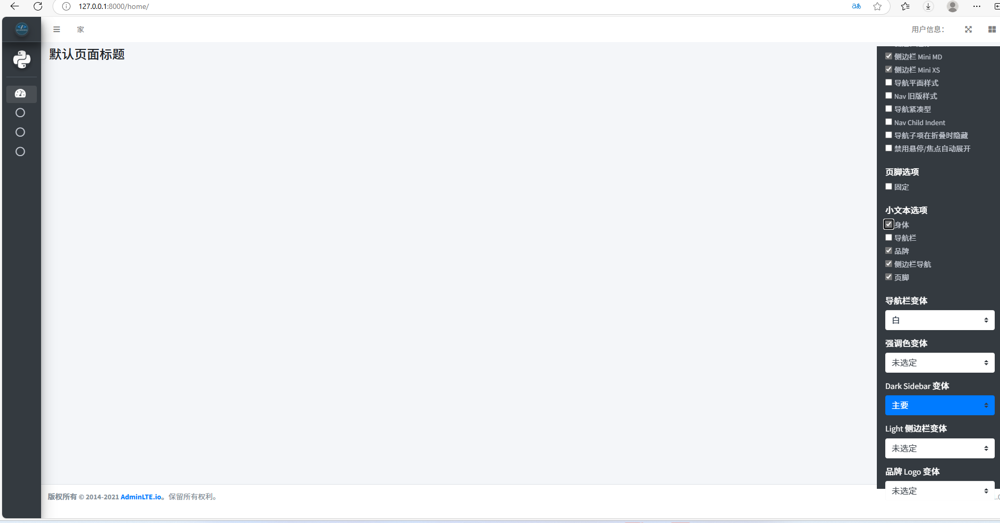
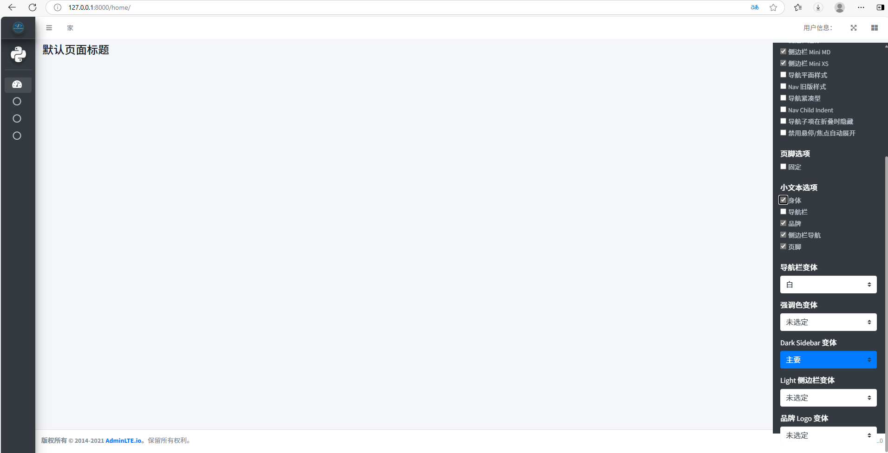

<<<<<<< HEAD
=======

>>>>>>> e668728da9c837482f48d012d3a62565144b41fe
《玉永军）

项目结构截图：
<<<<<<< HEAD

=======

>>>>>>> e668728da9c837482f48d012d3a62565144b41fe

项目功能：
深色模式（Dark Mode）：
允许用户切换到深色主题。
标题选项（Header Options）：
固定：固定头部导航栏。
下拉列表旧版偏移：为下拉菜单提供旧版的偏移。
无边框：移除头部导航栏的边框。
侧边栏选项（Sidebar Options）：
折叠：允许侧边栏折叠。
固定：固定侧边栏位置。
侧边栏迷你（Mini MD/XS）：提供不同大小的迷你侧边栏。
导航平面样式：使用平面样式的导航。
导航旧版样式：使用旧版的导航样式。
导航紧凑：使导航更加紧凑。
导航子项缩进：增加导航子项的缩进。
导航子项在折叠时隐藏：在侧边栏折叠时隐藏导航子项。
禁用悬停/焦点自动展开：禁用悬停或焦点时的自动展开功能。
页脚选项（Footer Options）：
固定：固定页脚位置。
小文本选项（Small Text Options）：
身体、导航栏、品牌、侧边栏导航、页脚：控制这些元素的小文本显示。
导航栏变体（Navbar Variants）：
<<<<<<< HEAD

=======

>>>>>>> e668728da9c837482f48d012d3a62565144b41fe
