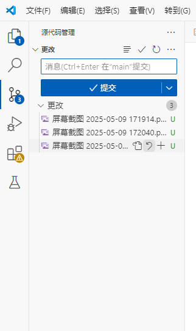

# DjangoForEveryone

## A repository for JimShapedCoding Django Tutorials

### Architecture of this repository:

 - baseapp - A Django application that I will work on, throughout some of my tutorials to explain and show topics.
   - This app includes a very basic customization, for visualizing data nice. And also templates/static directories being created there
 - In order to see more content on this repo, checkout to other branches like `post-tutorial`, to see the project status after I finish working on, in some tutorial.

 克隆组长仓库
 到我的仓库
 

在VScode上克隆我的仓库进行编辑和提交到我的仓库

配置依赖和环境
通过ai可以了解到怎么创建虚拟环境
创建venv虚拟环境运行项目并启动项目

